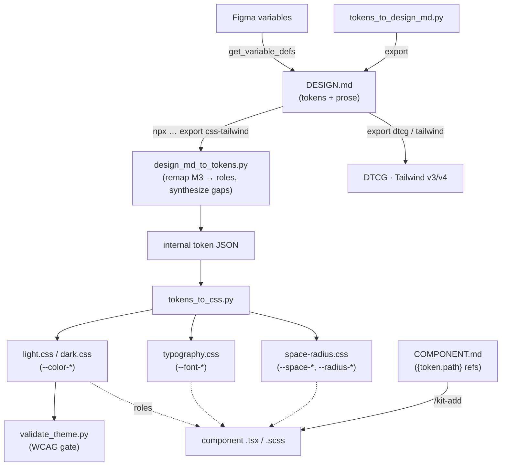

# Proposal: Aligning our markdown component patterns with `DESIGN.md`

> **This is a proposal for review, not an execution plan.** It captures the
> comparison between Google Labs' [`DESIGN.md`](https://github.com/google-labs-code/design.md)
> spec and our own markdown patterns, and proposes a two-part path: (A) let our
> components consume a `DESIGN.md`, and (B) publish a sibling spec for our
> component markdown. No spec text or code is written yet. Two scope decisions
> are already locked (see [Locked decisions](#locked-decisions)); the rest is
> open for discussion.

## Context

`DESIGN.md` (Google Labs, `version: alpha`) is a format spec for describing a
**visual identity to coding agents**. One file, two halves:

- **YAML front-matter** — machine-readable tokens: `colors`, `typography`,
  `spacing`, `rounded`, and a `components` map. Token references use
  `{colors.primary-60}` path syntax. Dimensions carry `px`/`em`/`rem` units.
- **Markdown body** — human-readable rationale in a fixed `##` section order:
  Overview → Colors → Typography → Layout → Elevation & Depth → Shapes →
  Components → Do's and Don'ts.

It is documented as a portable standard: a consumer-behavior table (unknown
section → preserve; **duplicate heading → reject the file**), a `version` field,
and an explicit "agents read this to produce UIs" consumption model with
`lint` / `diff` / `export` tooling (to Tailwind, W3C DTCG, Figma variables).

Crucially, its `components` section is **only style tokens** —
`backgroundColor`, `textColor`, `typography`, `rounded`, `padding`, `size`,
`height`, `width`, with variants expressed as sibling keys
(`button-primary`, `button-primary-hover`). It says nothing about props,
markup, behavior, or accessibility.

## The core finding

We have **two** markdown artifacts, at two different layers. `DESIGN.md`
overlaps with exactly one of them:

| Our artifact | Layer | Encodes | DESIGN.md overlap |
|---|---|---|---|
| `styles` skill + theme CSS (`light.css`/`dark.css`, `theme.schema.json`, OKLCH generator, `validate_theme.py`) | **Design-token layer** | Colors only — but with generation + WCAG contrast enforcement | **High** — this is the same layer |
| `component-<name>/reference.md` (9-section embedded-markdown shape) | **Implementation layer** | Full TSX/SCSS code, props interface, a11y contract | **None** — DESIGN.md has no equivalent |

> **`DESIGN.md` is a sibling to our `styles`/theme layer, not to our component
> `reference.md`.** Its `components` map is style tokens; our `reference.md` is
> a code-generation spec. They are complementary, which is *why* the work
> splits cleanly into two non-overlapping workstreams below.

### Side-by-side: token layer

| Dimension | `DESIGN.md` | Our `styles`/theme layer |
|---|---|---|
| Authoring surface | YAML front-matter | CSS custom properties (`light.css`/`dark.css`) |
| Color model | Any CSS color (hex, `oklch()`, named, `color-mix`) | Hex in files; OKLCH internally for generation |
| Color roles | Recommended (non-normative): `primary`, `secondary`, `tertiary`, `neutral`, `surface`, `on-surface`, `error` | **Enforced**: 15 required `--color-*` roles + 3 optional (18 total) |
| Typography tokens | First-class (`fontFamily`, `fontSize`, `fontWeight`, `lineHeight`, `letterSpacing`, `fontFeature`, `fontVariation`) | **None** — no token home |
| Spacing tokens | First-class scale map | **None** — components use rem literals |
| Rounded (radius) tokens | First-class scale map | **None** — components use rem literals |
| Component-level tokens | `components.<name>.<prop>` map | Per-component CSS vars (`--btn-primary-bg`, `--btn-padding-block`) |
| Light/dark | Single palette; dark mode underspecified | Both modes, auto-mirrored |
| Contrast enforcement | Lint warns | **`validate_theme.py` gate** (10 WCAG AA pairs) |
| Token references | `{colors.primary}` path syntax | `var(--color-primary, <fallback>)` cascade |
| Interop targets | tokens.json, Figma, Tailwind, DTCG | Internal JSON schema (round-trip only) |

The two systems are strikingly close on colors, and our contrast gate is
*stronger* than DESIGN.md's lint. The gaps are **typography, spacing, and
rounded** — DESIGN.md has token homes for all three; we have none.

## Architecture at a glance

End-to-end flow once both workstreams land (solid = data transform, dashed =
cascade-time token consumption):



Inbound on the left (Figma/DESIGN.md → our theme), outbound on the right
(our tokens → DESIGN.md → DTCG/Tailwind). The two markdown sources — `DESIGN.md`
(tokens) and `COMPONENT.md` (implementation) — meet only through the
`{token.path}` reference contract, never directly.

## Locked decisions

Settled before this draft:

1. **Deliverable: proposal doc only.** No spec text and no adapter code in this
   pass — this document is the artifact, for review first.
2. **Token scope: full parity with `DESIGN.md`.** The target is to give our
   token layer a home for **typography, spacing, and rounded** in addition to
   colors — not to stay colors-only. This is the larger, more invasive scope
   and changes how components reference dimensions (rem literals → tokens).

Resolved in the 2026-06-14 review:

3. **Parse route: Route 1 — consume the `css-tailwind` export.** The adapter
   shells `npx @google/design.md export --format css-tailwind` and parses the
   CSS custom properties in Python stdlib. Accepts a Node/`npx` dependency at
   build *and* runtime (`/theme-from-design`) in exchange for never drifting
   from the alpha grammar. (Settles old open questions on parse route and
   runtime-vs-build dependency.)
4. **`missing-primary` is a hard error.** `validate_design_md.py` rejects a
   DESIGN.md with no primary (follows the spec's normative MUST, diverges from
   the CLI's warning) — the primary is the OKLCH seed the pipeline needs.
5. **`COMPONENT.md` lives in `style-agent`.** The spec is framework-agnostic and
   publishable, matching DESIGN.md's neutrality; acss-kit's `reference.md` docs
   conform to it rather than owning it.
6. **The component sweep ships as phased PRs.** Token homes → button pilot (with
   a golden-output test) → bulk-migrate the remaining 14, per the roadmap.

## Workstream A — let our components *consume* a `DESIGN.md`

The seam is our **theme pipeline**, not the per-component files. Components
already read semantic CSS variables, and those roles are owned exclusively by
theme files (the `@layer foundation, components, utilities, theme` cascade
means theme always wins). So "consuming `DESIGN.md`" =
**adding `DESIGN.md` as a new input to the `styles` pipeline**, alongside
seed-hex / Figma / image extraction:

```
DESIGN.md (YAML front-matter)
   └─ design_md_to_tokens.py        ← NEW adapter (parse + map)
        └─ tokens_to_css.py         ← exists
             ├─ light.css / dark.css           (colors)
             ├─ typography.css                  (NEW — typography tokens)
             └─ space-radius.css                (NEW — spacing + rounded tokens)
        └─ validate_theme.py        ← exists (WCAG contrast gate)
```

Surfaced as a new flow (`/theme-from-design DESIGN.md`) or by extending
`/theme-extract` to accept a `.md` input.

### Grounding: a real DESIGN.md

The upstream [`examples/paws-and-paths/DESIGN.md`](https://github.com/google-labs-code/design.md/blob/main/examples/paws-and-paths/DESIGN.md)
makes the mapping concrete — and reveals that real files follow
**Material Design 3 (M3) naming**, not the spec's short "recommended" list:

- **Colors** are an M3 set: `surface`, `surface-container-low…highest`,
  `on-surface`, `on-surface-variant`, `primary`, `on-primary`,
  `primary-container`, `secondary`/`tertiary` (+ `-container`, `on-`),
  `outline`, `outline-variant`, `error`, `error-container`, `inverse-surface`.
  That's **~45 color tokens** — *more* than our 15 roles, with `on-X`
  foreground pairs and a surface-elevation ladder.
- **Spacing** is in **px** with semantic keys: `base: 8px`, `xs…xl`, plus
  `gutter: 16px`, `margin: 24px`.
- **Rounded** uses a Tailwind-style **`DEFAULT`** key and mixes units:
  `sm: 0.25rem … xl: 1.5rem`, `full: 9999px`.
- **Typography** composites carry `fontWeight` as a **quoted string** (`"800"`)
  and `fontSize`/`lineHeight` in px, `letterSpacing` in em.
- **Components** have **freeform names** (`button-primary`, `card-walk-stat`,
  `list-item-walker`, `badge-status`) referencing `{colors.*}`,
  `{typography.*}`, `{rounded.*}`, `{spacing.*}`.

### Color mapping (DESIGN.md M3 → our roles)

The realistic job is **collapse**, not just fill — M3 supplies more roles than
we have, so the adapter selects/merges:

| DESIGN.md (M3) token | Our role | Notes |
|---|---|---|
| `primary` | `--color-primary` | direct |
| `primary-container` / `inverse-primary` | `--color-primary-hover` | best-effort state derivation |
| `on-primary` | `--color-text-inverse` | `on-X` → inverse text |
| `surface` / `background` | `--color-surface` / `--color-background` | M3 splits these; we map both |
| `surface-container*` ladder | `--color-surface-raised` / `--color-surface-subtle` | collapse N levels → our 2 |
| `on-surface` | `--color-text` | direct |
| `on-surface-variant` | `--color-text-muted` | direct |
| `outline` / `outline-variant` | `--color-border` / `--color-border-strong` | direct |
| `error` | `--color-danger` | alias |
| `secondary` / `tertiary` | `--color-brand-accent` (optional) | best-effort |
| *(success/warning/info — M3 has no slots)* | `--color-success`/`warning`/`info` | **synthesize via OKLCH** |

So the adapter does both directions: **collapse** the M3 surface/on-pairs into
our 15, and **synthesize** the roles M3 omits (success/warning/info, focus-ring)
via the existing OKLCH algorithm — then gate everything on `validate_theme.py`.
DESIGN.md is also **mode-thin** (the example is a single light palette), where we
are light+dark — confirming the adapter must generate the dark mode from the
supplied primitives. Normalization the adapter must handle, all seen in the real
file: **px → rem** (÷16), the **`DEFAULT`** rounded key, **`9999px` → `full`**,
and **quoted `fontWeight`** strings.

### Typography / spacing / rounded mapping (the full-parity work)

This is the part that does not exist yet and is the bulk of the effort:

| DESIGN.md | New token home (proposed) | Component change |
|---|---|---|
| `typography.<name>` (`fontFamily`, `fontSize`, `fontWeight`, `lineHeight`, `letterSpacing`, …) | `--font-*` custom properties in a new `typography.css` theme file | Components reference `--font-body-md-*` instead of hardcoded `font-size`/`line-height` |
| `spacing.<scale>` (`xs`…`xl`, `base`) | `--space-*` custom properties | Components reference `--space-md` instead of rem literals in padding/gap/margin |
| `rounded.<scale>` (`sm`…`full`) | `--radius-*` custom properties | Components reference `--radius-md` instead of hardcoded `border-radius` |

**Quantified sweep (measured across all 15 component `reference.md` files):**

| Sweep | Components touched | Declaration sites | Heaviest | Lightest |
|---|---|---|---|---|
| Spacing literals → `var(--space-*)` | 14 / 15 | **~97** | Dialog (12), Nav (9) | Img (1) |
| Radius literals → `var(--radius-*)` | 12 / 15 | **~19** | Button (3: std + pill + icon) | most (1) |
| Typography literals → `var(--font-*)` | 13 / 15 | **~47** | Button (6), Table (5) | Checkbox/List/Popover (1) |

~**163 declaration sites** total. Bounded and mechanical, but real — best staged
as its own sub-effort after the token homes land, with a golden-output test per
component so the swap is provably value-preserving (the same pattern used for the
component-skill split).

Open questions this raises (flagged, not resolved):

- **Schema growth.** `theme.schema.json` and `_tokens.py` `ROLE_GROUPS` are
  colors-only today. Full parity means new schema sections, new validators
  (units, scale completeness), and new round-trip coverage in
  `css_to_tokens.py`.
- **Contrast vs. typography/spacing.** Our validation gate is contrast-only.
  Typography/spacing tokens have no equivalent automated gate — we'd decide
  whether to add scale-completeness / minimum-target-size checks or leave them
  unvalidated.

### Current-state token debt the sweep can fold in

The inventory surfaced existing drift worth fixing *while* we're in these files:

- **`button` references `--color-primary-dark`**, which is **not one of our 15
  canonical roles** (the schema defines `--color-primary-hover`). This is a live
  inconsistency — the button's hover color resolves to a fallback today.
- **`alert` hardcodes its state colors** (`#d1ecf1`, `#bee5eb`, …) instead of
  consuming the existing `--color-info` / `--color-success` / `--color-warning`
  / `--color-danger` semantic roles. Full parity should wire these to roles, so
  a DESIGN.md (or `/theme-*`) actually recolors alerts.

These aren't new scope so much as cleanup the parity sweep naturally absorbs —
and they argue for a **role-reference audit** step in the same effort.

## Workstream B — publish a sibling spec for our component markdown

`DESIGN.md`'s value is partly that it is *written up as a portable, versioned
standard*. Our `reference.md` shape is equally rigorous but only encoded
implicitly inside the `acss-kit-component-author` maintainer skill and
kit-core's Step B. The proposal: **formalize our component-markdown format into
a documented spec** — working name `COMPONENT.md`, **owned by `style-agent`**
(framework-agnostic, so acss-kit's `reference.md` docs *conform to* it rather
than own it) — mirroring `DESIGN.md/docs/spec.md`:

- Purpose + bipartite format (front-matter + markdown body).
- Fixed section order (our existing 9 sections: Verification banner, Overview,
  Generation Contract, Props Interface, TSX Template, CSS Variables, SCSS
  Template, Accessibility, Usage Examples).
- Grammar for each block (Generation Contract fields, Props union literals,
  TSX/SCSS template rules, the Accessibility WCAG-criteria contract).
- **A token-reference syntax that points *into* `DESIGN.md`** — the CSS
  Variables section would declare `--btn-primary-bg: {colors.primary}` and
  `--btn-padding-block: {spacing.md}` instead of hardcoding values. This is the
  hinge that connects B back to A.
- Consumer-behavior table (unknown section → preserve; duplicate → reject) and
  a `version: alpha` field, matching DESIGN.md's conventions.

One wrinkle the real example exposes: DESIGN.md `components` entries have
**freeform, project-specific names** (`card-walk-stat`, `list-item-walker`,
`badge-status`) with no clean 1:1 to our component set. So `COMPONENT.md` can't
assume a DESIGN.md provides a matching component block — it must reference the
**primitive** token groups (`{colors.*}`, `{spacing.*}`, `{rounded.*}`,
`{typography.*}`), which *are* stable, and treat DESIGN.md's `components.*` map
as optional per-instance overrides. This keeps the two specs loosely coupled.

The payoff is a **two-file design system**: `DESIGN.md` owns visual identity
(tokens), `COMPONENT.md` owns component implementation and *references* DESIGN.md
tokens. That fills a niche DESIGN.md deliberately leaves empty (it stops at
style tokens for components), and it makes our format publishable and
interoperable the same way DESIGN.md is.

### Why B likely precedes A in execution

Writing the `COMPONENT.md` spec first forces the `{path}` token-reference
contract that the adapter in A must then resolve. The spec defines the
interface; the adapter implements it. B is also docs-only and lower-risk. (This
ordering is a recommendation for the *eventual* build, not a decision for this
proposal pass.)

## Workstream C — tooling & integration surface

"Aligning" only pays off if the tooling is wired end to end. This section
inventories **what already exists upstream**, **the new tools we'd build**, and
**how it threads into our existing infra and the MCP servers in-session**.

### C.1 Upstream `@google/design.md` toolchain (adopt, don't rebuild)

The official npm package ships a Node CLI and a linter API. We should **reuse**
it rather than re-implement, and treat it as a **build/CI-time tool** (like the
`npm` deps already in `tests/`), not a plugin runtime dependency.

| Upstream tool | What it does | How we use it |
|---|---|---|
| `npx @google/design.md lint <file>` | 9 rules → JSON findings (`broken-ref` error; `missing-primary`, `contrast-ratio`, `orphaned-tokens`, `missing-typography`, `section-order`, `unknown-key` warnings; `token-summary`, `missing-sections` info) | CI gate + PostToolUse hook on `DESIGN.md` edits |
| `npx @google/design.md diff <before> <after>` | Token-level + regression diff, exit 1 on regression | CI brand-drift check across commits |
| `npx @google/design.md export --format <fmt> <file>` | `json-tailwind` (TW v3 `theme.extend`), `css-tailwind` (TW v4 `@theme {}` custom props), `dtcg` (W3C DTCG JSON) | **Primary import path** — see C.2 |
| `npx @google/design.md spec [--rules]` | Emits the spec / lint-rules table (markdown or json) | Pin a copy as our reference; drives our `COMPONENT.md` sibling spec |
| `@google/design.md/linter` → `lint(str)` → `{findings, summary, designSystem}` | Programmatic parse into `DesignSystemState` | Optional Node test helper if we want richer fixtures |

Confirmed **omissions** upstream (things we'd own if we want them): no import
(it's export-only), no JSON schema file, no Figma plugin, no GitHub Action, no
IDE extension. (Upstream is a Bun/Turbo monorepo with the CLI in
`packages/cli/`; its `.agents/skills/` are *dev* skills — `tdd`, `ink`,
`agent-dx-cli-scale` — not design-system consumption skills, so there's nothing
to reuse there.)

**DTCG alignment is effectively free.** Because `export dtcg` already emits W3C
Design Tokens from a DESIGN.md, our *internal* token JSON does **not** need to
*be* DTCG — we get DTCG interop by piping through the CLI, and avoid coupling our
schema to the evolving DTCG draft.

### C.2 The pivotal architectural decision: how we parse DESIGN.md — DECIDED

Our plugin scripts are **Python 3 stdlib-only** — and **stdlib has no YAML
parser**. DESIGN.md front-matter is YAML with `{token.path}` references. So we
cannot naively `import yaml`. Two routes were weighed:

- **Route 1 — consume the CLI's export output (CHOSEN).** Shell out to
  `npx @google/design.md export --format css-tailwind` and parse the resulting
  **CSS custom properties in Python** (stdlib-friendly; see Appendix F). This
  offloads YAML parsing *and* `{token.path}` reference resolution to the upstream
  parser, so we never drift from the alpha grammar. Cost: a Node/`npx`
  dependency at build *and* runtime (`/theme-from-design`) — accepted in the
  2026-06-14 review.
- **Route 2 — minimal stdlib YAML-subset parser.** Hand-roll a parser for the
  constrained subset DESIGN.md uses plus a reference resolver. Zero runtime
  deps, but re-implements upstream and risks drift. *Not chosen.*

**Decision:** Route 1, `css-tailwind` input. The Node/`npx` runtime dependency
for `/theme-from-design` is accepted. (`dtcg` stays an export-only interop
target, not an import path.)

### C.3 New tools we build (mapped to our contract families)

Following `.claude/rules/python-scripts.md` (detector vs. generator/validator):

| New tool | Kind | Contract | Role |
|---|---|---|---|
| `design_md_to_tokens.py` | Python script | generator/validator (data→stdout, errs→stderr, 0/1/2) | DESIGN.md (via CLI export JSON) → our internal token JSON; maps colors→roles, fills gaps via OKLCH, lifts typography/spacing/rounded |
| `validate_design_md.py` | Python script | detector (JSON+`reasons`, 0/1) | Thin normalizer: shells `npx … lint`, reshapes findings into our detector JSON so skills/hooks can parse it uniformly |
| `tokens_to_design_md.py` | Python script | generator/validator | **Export** our theme CSS → a DESIGN.md (the import-*into*-DESIGN.md direction upstream lacks) — closes the round-trip |
| `/theme-from-design <DESIGN.md>` | Command + `styles` flow | — | Workstream-A entry: DESIGN.md → `tokens_to_css.py` → light/dark + typography + space-radius CSS → `validate_theme.py` |
| `/design-export [--format=design-md\|dtcg\|tailwind]` | Command + `styles` flow | — | Our tokens → DESIGN.md (ours) or interop formats (upstream CLI) |
| `design-md` references | `styles`/`kit-core` reference docs | — | Mapping table (DESIGN.md token ↔ our role), pinned spec excerpt, version SHA |

These slot beside the existing script set (`generate_palette.py`,
`tokens_to_css.py`, `css_to_tokens.py`, `validate_theme.py`,
`generate_bridge.py`, `verify_integration.py`, `oklch_shift.py`, …) without
changing their contracts.

### C.4 Wiring into existing infra

- **Hooks** (`.claude/settings.json` PostToolUse): add a validator that fires on
  Write/Edit to any `DESIGN.md` (and our future `COMPONENT.md`), shelling
  `validate_design_md.py` — mirrors how we already validate `plugin.json`,
  command front-matter, and SKILL.md front-matter.
- **Rules** (`.claude/rules/`): a new advisory rule on `**/DESIGN.md` (and
  `**/COMPONENT.md`) reminding of section order, `{token.path}` syntax, and the
  role-name translation table — same pattern as `scss-conventions.md`.
- **Tests** (`tests/run.sh`): add a step that (a) lints fixture DESIGN.md files,
  and (b) round-trips DESIGN.md → tokens → CSS → `validate_theme.py`, asserting
  contrast holds. Optionally a golden test: a fixture DESIGN.md must produce a
  byte-stable theme.
- **Pre-submit checklist / CI**: `npx @google/design.md lint` and `diff` on any
  committed DESIGN.md; `diff` surfaces brand regressions in PRs.

### C.5 MCP servers we can take advantage of in-session

The live session already exposes servers that map directly onto DESIGN.md's
"convert to/from Figma variables, tokens.json" interop promise:

- **Figma MCP** (`get_variable_defs`, `search_design_system`,
  `get_design_context`, `get_code_connect_map`): pull Figma variables →
  synthesize a DESIGN.md (or feed `design_md_to_tokens.py` directly); or push
  our generated tokens back as Figma variables. This makes
  Figma ⇄ DESIGN.md ⇄ our theme a real round-trip and supersedes the current
  `/theme-extract` Figma path with a standards-based one. (Our `/theme-extract`
  already delegates to a `figma-design-tokens` skill — this is its evolution.)
- **context7**: fetch current `@google/design.md` package docs while authoring
  the adapter, so we track the moving `alpha` surface instead of guessing.
- **github MCP**: run the lint/diff gates as PR checks; post DESIGN.md diff
  summaries on brand-changing PRs.

## How projects take advantage of DESIGN.md

Beyond "consume a file," the integration unlocks concrete project workflows:

1. **Persistent, agent-portable brand source of truth.** One `DESIGN.md` in the
   repo root survives across sessions and across *different* agents/tools — the
   problem DESIGN.md was built to solve. Every `/kit-add` and `/theme-*`
   invocation reads from it instead of re-deriving brand each time.
2. **One-file project onboarding.** Drop a DESIGN.md → `/theme-from-design`
   generates the full token surface (colors + typography + spacing + radius) →
   `/kit-create` scaffolds components already wired to those tokens. Zero manual
   theme authoring.
3. **Cross-framework reach via `style-agent`.** This is the biggest audience
   expansion: `style-agent` is framework-agnostic, and DESIGN.md +
   `export css-tailwind`/`json-tailwind` lets **any** Tailwind or plain-CSS
   project consume the same brand — not just fpkit/acss projects. DESIGN.md
   becomes the neutral interchange that both plugins share.
4. **Design↔engineering contract.** Figma variables ⇄ DESIGN.md ⇄ our CSS keeps
   designers and engineers on one synchronized token set, round-tripped through
   the Figma MCP.
5. **Brand-drift detection in CI.** `diff` two DESIGN.md revisions to catch
   unintended token changes; `lint`'s `contrast-ratio` rule plus our
   `validate_theme.py` form a double a11y gate.
6. **Portability / no lock-in.** `export dtcg` emits W3C Design Tokens, so a
   project's brand flows out to any DTCG-aware tool — adopting our plugins
   doesn't trap the design system in a proprietary format.
7. **Multi-brand at scale.** A DESIGN.md per brand maps onto our existing
   `brand-*.css` preset mechanism, so theming many brands is a directory of
   DESIGN.md files, each linted and contrast-gated.

## Risks & tensions

- **Full parity is a large surface.** Typography + spacing + rounded token
  homes plus a 15-component SCSS sweep is materially bigger than the colors-only
  alternative. Worth staging into independent PRs (token homes → one component
  pilot → bulk sweep), mirroring how the component-skill split was staged.
- **DESIGN.md is `alpha`.** The upstream format may change. Pinning to a commit
  SHA (as we already do for fpkit references) and isolating all DESIGN.md
  knowledge inside `design_md_to_tokens.py` limits blast radius.
- **Naming divergence.** Our roles (`--color-danger`, `--color-text`) differ
  from DESIGN.md's (`error`, `on-surface`). The translation table is a
  maintenance surface and a place silent mismatches can hide — it needs tests.
- **Round-trip symmetry.** We currently round-trip CSS↔JSON via
  `css_to_tokens.py`. A DESIGN.md export path (CSS → DESIGN.md) would be the
  natural symmetric feature but is explicitly out of scope here; note it as a
  follow-on.

## Open questions for review

The four load-bearing decisions are now settled (see
[Locked decisions](#locked-decisions)). Remaining smaller calls:

1. **`COMPONENT.md` name.** Home is decided (`style-agent`); the file/spec name
   is not finalized — `COMPONENT.md` vs. e.g. `COMPONENTS.md` / `UI.md`.
2. **Token file layout.** One combined `theme.css` or separate
   `typography.css` / `space-radius.css` files? Affects the `@layer` cascade and
   import order. (Roadmap PR 1 assumes separate files; revisit there.)
3. **DESIGN.md authoring direction.** We will *consume* DESIGN.md and *export*
   to it (`tokens_to_design_md.py`, roadmap PR 5). Open: do we also offer a
   `styles` flow that *authors* a fresh DESIGN.md from a seed color, or is
   export-from-existing-theme enough?

## Next step

The four load-bearing decisions are **resolved** (Route 1 / hard-fail on missing
primary / `style-agent` owns `COMPONENT.md` / phased sweep), so the path is
unblocked. The immediate follow-on is to convert the workstreams into execution
plans under `docs/plans/`, in roadmap order:

1. **Workstream B — `COMPONENT.md` spec** (roadmap PR 0), authored in
   `style-agent`. Lowest-risk, docs-only, and it defines the `{token.path}`
   contract the adapter consumes. → execution plan:
   [`component-md-spec.md`](component-md-spec.md).
2. **Workstream A token homes + adapter** (roadmap PRs 1 → 4), `css-tailwind`
   input, then the phased component sweep (PRs 2 → 3). → execution plan:
   [`design-md-token-parity.md`](design-md-token-parity.md).

Both workstreams now have execution plans; the remaining roadmap PRs (5 export-out,
6 Figma bridge/hooks/tests) are scoped inside those plans' "out of scope" notes.

---

## Appendix A — M3 → our-roles translation table (draft)

Derived from the real `paws-and-paths` example (M3 naming) against our 15
required + 3 optional roles. This is the load-bearing artifact for
`design_md_to_tokens.py`; both **collapse** (many M3 → one of ours) and
**synthesize** (M3 has no slot → OKLCH) appear.

| Our role | Source M3 token(s) | Strategy |
|---|---|---|
| `--color-background` | `background` (fallback `surface`) | direct |
| `--color-surface` | `surface` / `surface-container-lowest` | direct |
| `--color-surface-raised` | `surface-container-high` / `-highest` | collapse ladder |
| `--color-surface-subtle` *(opt)* | `surface-container-low` / `surface-dim` | collapse ladder |
| `--color-text` | `on-surface` / `on-background` | direct |
| `--color-text-muted` | `on-surface-variant` | direct |
| `--color-text-subtle` *(opt)* | `on-surface-variant` (lightened) | derive |
| `--color-text-inverse` | `on-primary` | `on-X` → inverse |
| `--color-border` | `outline-variant` | M3 `-variant` is the *softer* outline |
| `--color-border-strong` | `outline` | M3 `outline` is the *stronger* one |
| `--color-primary` | `primary` | direct |
| `--color-primary-hover` | `primary-container` / `inverse-primary` | best-effort state |
| `--color-danger` | `error` | alias |
| `--color-success` | *(none in M3)* | **synthesize via OKLCH** (hue ≈ 145°) |
| `--color-warning` | *(none in M3)* | **synthesize** (hue ≈ 85°) |
| `--color-info` | `tertiary` (if blue) else *(none)* | map-or-synthesize |
| `--color-focus-ring` | *(none)* | **synthesize** (usually = `primary`) |
| `--color-brand-accent` *(opt)* | `secondary` | direct |

Dropped on collapse (no target role, acceptable loss): `surface-tint`, the
`*-container`/`on-*-container` accent pairs, and all `*-fixed`/`*-fixed-dim`
variants. The table itself should ship as a `styles` reference doc so the
mapping is reviewable and testable in isolation.

## Appendix B — Figma ⇄ DESIGN.md bridge (MCP I/O contract)

Confirmed shapes of the in-session Figma MCP tools that make the bridge real:

| Tool | Input | Output | Use in this design |
|---|---|---|---|
| `get_variable_defs` | `fileKey`, `nodeId` | flat map `{ 'color/primary': '#855300', 'spacing/md': '24px' }` | Figma variables → DESIGN.md tokens (author) or → our roles directly. Same freeform-naming → translation-table problem as M3. |
| `get_code_connect_map` | `fileKey`, `nodeId` | `{ nodeId: { codeConnectSrc, codeConnectName } }` | Links a Figma component node to a **codebase component file** — i.e. a Figma "Button" ↔ our `component-button`. Can auto-populate a `COMPONENT.md` ↔ Figma binding. |
| `add_code_connect_map` | mapping | — | Push our components back so designers see which code implements each design node (code→design direction). |
| `get_design_context` | `fileKey`, `nodeId` | code + screenshot + metadata | Visual grounding when reconciling a token change against a real frame. |

Net: **Figma variables → DESIGN.md → our theme** (inbound, via
`get_variable_defs`) and **our components → Figma Code Connect** (outbound, via
`add_code_connect_map`) form the two-way bridge DESIGN.md's interop promise
implies — and reuse the same translation table as Appendix A.

## Appendix C — `validate_design_md.py` parity (detector contract)

Our validator (detector contract: JSON to stdout, `reasons` array, exit 0/1)
normalizes upstream `lint` output plus the spec's normative consumer-behavior
table:

| Finding | Spec / CLI severity | Our exit impact |
|---|---|---|
| Duplicate section heading | **Error — reject file** (normative MUST) | exit 1 |
| `broken-ref` (unresolved `{token.path}`) | Error | exit 1 |
| `missing-primary` | **Spec: MUST** define a primary / **CLI: warning** — *discrepancy to resolve* | exit 1 (follow spec) |
| `contrast-ratio` (WCAG AA) | Warning | reason, exit 0 (our `validate_theme.py` is the hard gate post-generation) |
| `orphaned-tokens`, `missing-typography`, `section-order`, `unknown-key` | Warning | reason, exit 0 |
| `unknown-component-property` | Accept **with warning** | reason, exit 0 |
| Unknown section / color / typography / spacing | **Preserve; do not error** | no reason |
| `token-summary`, `missing-sections` | Info | informational reason |

The one real conflict — the **spec says a primary color MUST be defined**
(reject) while the **CLI treats `missing-primary` as a warning** — is
**settled**: we follow the spec and **hard-fail** (exit 1), since a primary is
the OKLCH seed our whole pipeline depends on.

## Appendix D — Worked example: `paws-and-paths` DESIGN.md → our `light.css`

Applying Appendix A to the real example's hex values, end to end. This is the
output `/theme-from-design` would produce for the light mode (dark mode is then
OKLCH-mirrored):

| Our role | Resolved hex | Source |
|---|---|---|
| `--color-background` | `#f9f9ff` | `background` |
| `--color-surface` | `#f9f9ff` | `surface` |
| `--color-surface-raised` | `#e2e8f8` | `surface-container-high` |
| `--color-surface-subtle` | `#f0f3ff` | `surface-container-low` |
| `--color-text` | `#151c27` | `on-surface` |
| `--color-text-muted` | `#534434` | `on-surface-variant` |
| `--color-text-inverse` | `#ffffff` | `on-primary` |
| `--color-border` | `#d8c3ad` | `outline-variant` |
| `--color-border-strong` | `#867461` | `outline` |
| `--color-primary` | `#855300` | `primary` |
| `--color-primary-hover` | `#f59e0b` | `primary-container` |
| `--color-danger` | `#ba1a1a` | `error` |
| `--color-info` | `#00658b` | `tertiary` (blue) |
| `--color-brand-accent` | `#0058be` | `secondary` |
| `--color-success` | *generated* | OKLCH-synthesized (no M3 slot) |
| `--color-warning` | *generated* | OKLCH-synthesized (no M3 slot) |
| `--color-focus-ring` | `#855300` | = `primary` |

Spot-check the gate: `--color-text-inverse` `#ffffff` on `--color-primary`
`#855300` ≈ **6.4:1** (passes the 4.5:1 button-label pairing);
`--color-text` `#151c27` on `--color-background` `#f9f9ff` ≈ **16:1** (passes).
So this DESIGN.md would generate a contrast-valid theme with **2 roles
synthesized** and the rest mapped — exactly the collapse-plus-synthesize model.
A frozen copy of this table makes an ideal `tests/` round-trip fixture.

## Appendix E — Worked example: a sample `COMPONENT.md` (button)

A sketch of the Workstream-B format, mirroring DESIGN.md's bipartite shape
(YAML front-matter + prose) but for an implementation spec. Note the
`{token.path}` references pointing into a sibling DESIGN.md:

```markdown
---
spec: component.md
version: alpha
name: button
element: button
verified-against: "@fpkit/acss@6.5.0"
tokens:
  background: "{colors.primary}"
  textColor: "{colors.on-primary}"
  rounded: "{rounded.md}"
  paddingBlock: "{spacing.sm}"
  paddingInline: "{spacing.md}"
  typography: "{typography.label-md}"
variants:
  hover: { background: "{colors.primary-container}" }
  danger: { background: "{colors.error}" }
props:
  type: { values: [button, submit, reset], required: true }
  disabled: { type: boolean, a11y: "aria-disabled, stays in tab order" }
  size: { values: [xs, sm, md, lg, xl, 2xl] }
  color: { values: [primary, secondary, danger, success, warning] }
a11y:
  - 2.1.1 Keyboard (disabled stays focusable)
  - 2.4.7 Focus Visible
  - 2.5.8 Target Size (44x44 min)
---

## Overview
The primary interactive element. Uses `aria-disabled` instead of native
`disabled` to remain keyboard-operable (WCAG 2.1.1).

## Generation Contract
export_name: Button · file: button.tsx · scss: button.scss · imports: UI from '../ui'

## Template
<!-- the existing TSX/SCSS templates, unchanged -->

## Accessibility
<!-- the existing WCAG contract -->
```

Two things this sketch demonstrates: (1) the **token block is the bridge** —
it resolves against whatever DESIGN.md is in the project, so the same
`COMPONENT.md` re-skins per brand; (2) it references **primitive** groups
(`{colors.*}`, `{spacing.*}`) not DESIGN.md `components.*`, per the loose-coupling
decision in Workstream B. The existing 9-section `reference.md` body
(TSX/SCSS/Accessibility) carries over verbatim — `COMPONENT.md` formalizes the
*envelope*, not a rewrite of the content.

## Appendix F — Adapter input shape (export formats)

Confirmed from `packages/cli/src/commands/export.ts`: each format routes through
an emitter handler — `TailwindEmitterHandler` (`json-tailwind`/`tailwind`),
`TailwindV4EmitterHandler` → `serializeTailwindV4(theme)` (`css-tailwind`), and
`DtcgEmitterHandler` (`dtcg`). The two candidate inputs for
`design_md_to_tokens.py`:

**`css-tailwind`** — a Tailwind v4 `@theme { }` block of CSS custom properties.
Tailwind v4 namespaces tokens as `--color-*`, `--spacing-*`, `--radius-*`,
`--font-*`, `--text-*` (font-size). The happy consequence: the prefix
**already matches our `--color-*` convention**, so extraction is a trivial
CSS-custom-property parse in Python stdlib — only the **M3-name remap of
Appendix A** remains (e.g. `--color-on-surface` → `--color-text`):

```css
@theme {
  --color-primary: #855300;
  --color-on-surface: #151c27;
  --color-surface-container-high: #e2e8f8;
  --radius-md: 0.75rem;
  --spacing-md: 24px;
  --text-body-md: 16px;
}
```

**`dtcg`** — W3C Design Tokens JSON: nested groups, each token an object with
`$type` + `$value` (composite `typography` carries an object `$value`):

```json
{
  "colors": { "primary": { "$type": "color", "$value": "#855300" } },
  "spacing": { "md": { "$type": "dimension", "$value": "24px" } },
  "typography": { "body-md": { "$type": "typography",
    "$value": { "fontFamily": "Plus Jakarta Sans", "fontSize": "16px",
                "fontWeight": 400, "lineHeight": "24px" } } }
}
```

**Recommendation:** consume **`css-tailwind`** as the adapter input. CSS-custom-
property parsing is trivial stdlib, the `--color-*`/`--radius-*`/`--spacing-*`
prefixes line up with our naming, and we avoid DTCG's nested `$value`/`$type`
unwrapping. Keep `dtcg` purely as our *export* interop target (Appendix C of
"DTCG is free"), not an import path. (Exact Tailwind-v4 prefixes should be
confirmed against `serializeTailwindV4` at build time — they drive the parser.)

## Phased delivery roadmap

A dependency-ordered sequence, sized S/M/L, mirroring how the component-skill
split was staged (pilot → bulk, golden tests throughout):

| PR | Scope | Workstream | Size | Depends on |
|---|---|---|---|---|
| **0** | This proposal *(done)* + `COMPONENT.md` spec draft + advisory rule | B | M | — |
| **1** | Token homes: extend `theme.schema.json` + `_tokens.py` `ROLE_GROUPS`; `tokens_to_css.py` emits `typography.css` + `space-radius.css`; new unit/scale validators | A (infra) | L | 0 |
| **2** | Sweep **pilot (button)**: literals → `var(--space/radius/font-*)`; fix `--color-primary-dark` debt; golden-output test | A | M | 1 |
| **3** | Bulk sweep remaining 14 (~150 sites) + wire `alert` state colors to roles | A | L | 2 |
| **4** | `design_md_to_tokens.py` (consume `css-tailwind`) + `validate_design_md.py` + `/theme-from-design` | A (core) | L | 1, parse-route decision |
| **5** | `tokens_to_design_md.py` + `/design-export` (round-trip out, incl. `dtcg`) | A | M | 4 |
| **6** | Figma bridge (`get_variable_defs` → DESIGN.md; Code Connect out) + PostToolUse hook + `tests/run.sh` round-trip step | C | M | 4 |

Critical path is **0 → 1 → 4**; the component sweep (2, 3) is parallelizable
once token homes (1) land and is the only *large* user-visible churn.

## Why DESIGN.md (vs. raw DTCG / Style Dictionary / Tailwind config)

For completeness on the "why adopt this format" question:

- **vs. raw DTCG / `tokens.json`:** DTCG is a token *interchange* format with no
  prose, no section grammar, and no agent-consumption story. DESIGN.md *layers
  rationale on top* and exports *to* DTCG — we get interop without losing the
  human/agent narrative. (We target DTCG on export, not as the authoring format.)
- **vs. Style Dictionary:** a build tool, not a portable spec — it transforms
  tokens but defines no canonical file a human/agent reads as source of truth.
- **vs. a Tailwind config:** framework-specific and code, not a neutral artifact;
  DESIGN.md *exports to* Tailwind (v3 and v4), so a Tailwind project is a
  consumer, not a competitor.
- **Net:** DESIGN.md is the only option that is simultaneously human-readable,
  agent-consumable, prose-bearing, and export-interoperable — which is exactly
  the seam our `styles` layer needs and the niche our `COMPONENT.md` extends.

## Appendix G — Consolidated tool & artifact inventory

Everything this effort touches, in one place — what's new vs. what already
exists and is reused.

**New (we build):**

| Artifact | Type | Contract / shape | Workstream |
|---|---|---|---|
| `COMPONENT.md` spec | doc | versioned spec (front-matter + body), `{token.path}` refs | B |
| `design_md_to_tokens.py` | Python | generator/validator (consumes `css-tailwind`) | A |
| `validate_design_md.py` | Python | detector (JSON + `reasons`, exit 0/1) | A |
| `tokens_to_design_md.py` | Python | generator (CSS → DESIGN.md, export-out) | A |
| `/theme-from-design` | command + `styles` flow | — | A |
| `/design-export` | command + `styles` flow | `--format=design-md\|dtcg\|tailwind` | A |
| `typography.css` / `space-radius.css` | generated output | `--font-*` / `--space-*` `--radius-*` | A |
| M3→roles reference (Appendix A) | `styles` reference doc | mapping table | A |
| DESIGN.md advisory rule | `.claude/rules/*.md` | fires on `**/DESIGN.md`, `**/COMPONENT.md` | C |
| DESIGN.md PostToolUse validator | `.claude/settings.json` hook | shells `validate_design_md.py` | C |
| `tests/run.sh` round-trip step | test | lint + DESIGN.md→CSS→contrast | C |

**Existing (reused unchanged or extended):**

| Artifact | Role here | Change |
|---|---|---|
| `tokens_to_css.py` | emits theme CSS from token JSON | extend: typography + space-radius outputs |
| `css_to_tokens.py` | CSS → JSON round-trip | extend: new token groups |
| `generate_palette.py` / `_oklch.py` | OKLCH palette + gap synthesis | reused for success/warning/info/focus-ring |
| `validate_theme.py` | WCAG contrast gate | reused as the hard gate post-adapter |
| `theme.schema.json` / `_tokens.py` | role contract | extend: typography/spacing/rounded sections |
| `verify_integration.py` | entrypoint import check | reused |
| `kit-core` `/kit-add` | component generation | reads `COMPONENT.md` token refs |
| 15 `component-*/reference.md` | implementation specs | swept: literals → token vars (PRs 2–3) |
| `@google/design.md` CLI | `lint`/`diff`/`export`/`spec` | adopted at build/CI time |
| Figma MCP (`get_variable_defs`, Code Connect) | design ⇄ token bridge | adopted in-session |
